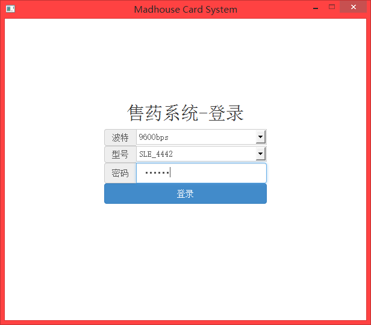
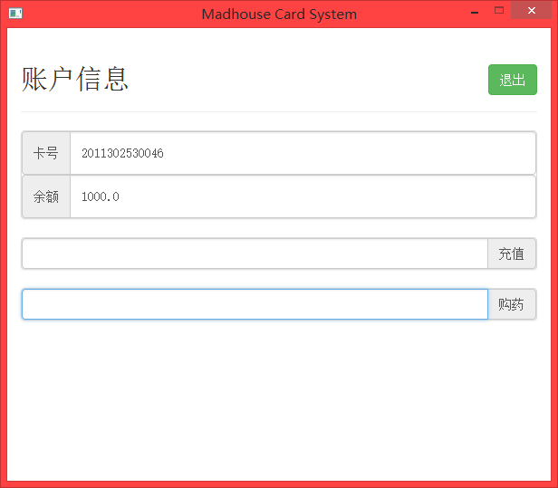

# madhouse_pharmacy

Madhouse pharmacy (build with smart card)

## Description

read & write a smart card via internet to emulate charge & consume operations.

## Features

* control a smart card and a card reader remotely (if you have put card into card reader and switch on the reader).

## Dependencies

*   flask
*   flask-bootstrap
*   mwic_32.dll

for window application:

*   PyQt4

## Usage

1.   make sure the driver has been installed.
2.   copy `mwic_32.dll` into src folder.
3.   run `ui.py` to open web ui or run `main`.py to open window ui. 

## card & card reader

*   type: `SLE_4442`
*   baud rate: `9600bps`

## Snapshot

*   

    ### window ui
    

